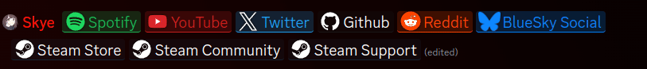

# EnhancedLinks
a Mini theme that enhances the appearance of links in Discord.

## Domain Support:
Currently, the following domains are supported.

Supported Domains

- Spotify: 
spotify.com

- YouTube: 
youtube.com 
youtu.be

- Twitter/X: 
twitter.com 
x.com 
fxtwitter.com 
fixupx.com 
vxtwitter.com 
fixvx.com

- Github: 
github.com

- Reddit: 
reddit.com

- BlueSky Social: 
bsky.app

- Steam Store: 
store.steampowered.com

- Steam Community: 
steamcommunity.com

- Steam Support: 
help.steampowered.com

More domains are to be added. If you have a domain you would like to be added, please make a [new issue](https://github.com/Nexus-Themes/EnhancedLinks/issues/new/choose). (Template TBA) 
PR's are also welcome!

### Regarding Fediverse (for now)
Due to the ability to selfhost your own instance of a given platform on the Fediverse (For example, Mastodon) I will not be adding support for these domains. There are too many unique domains to worry about, which pads the theme file unnecessarily. 

